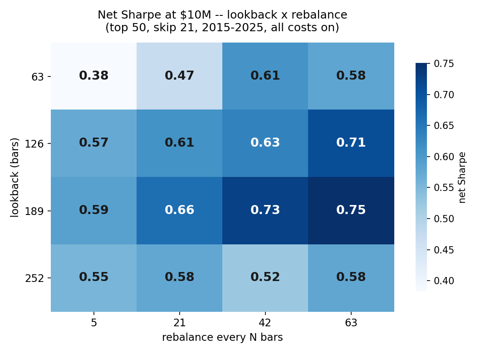
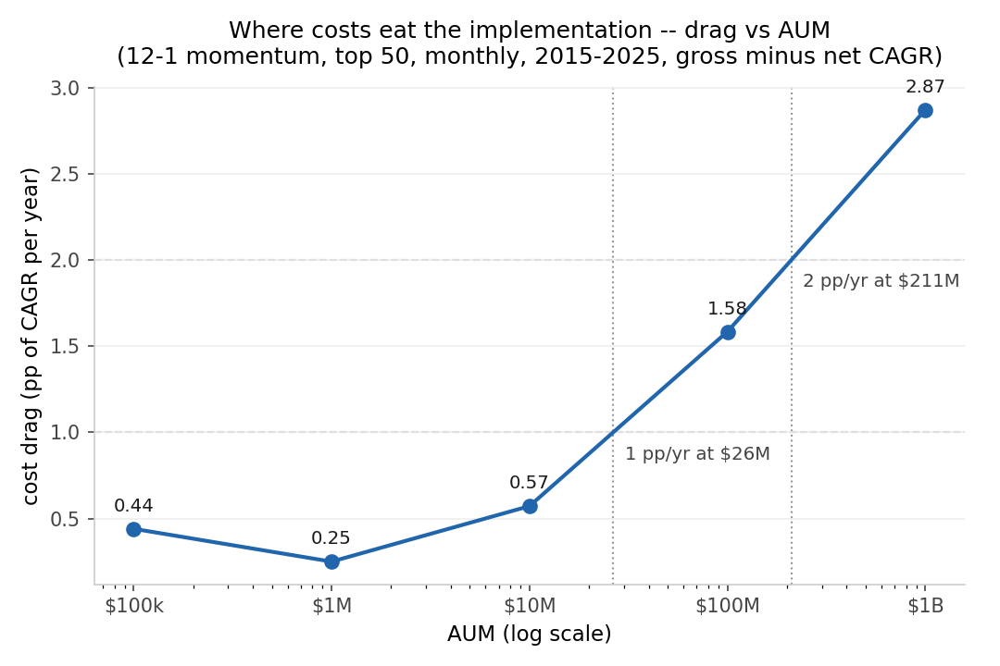
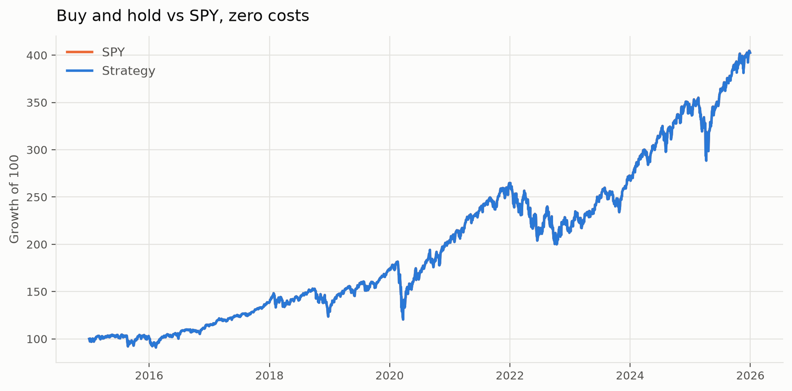
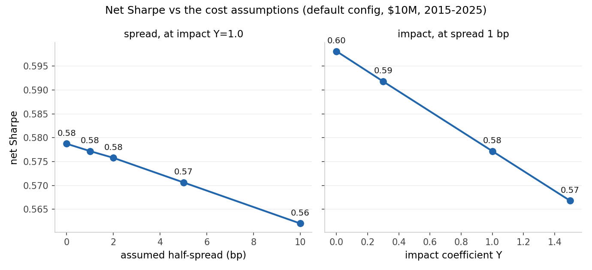

# event-driven-backtester

An event-driven backtesting engine in pure Python. I built it around one
idea: most backtests are wrong, and the interesting engineering lives in
the parts that make them wrong.

Look-ahead bias, survivorship bias, transaction costs and market impact
are modelled explicitly instead of assumed away, and every result states
the capital it was produced at.

## Results (measured, not claimed)

| What | Number | Window / trials |
|---|---|---|
| [Survivorship + index-addition bias](#what-survivorship-bias-was-worth) | **5.48 pp/yr** | 2015–2025, point-in-time S&P 500 vs today's list, zero costs |
| [12-1 momentum vs PIT equal weight](#the-first-strategy-measured-honestly) | **−0.87 pp/yr** net at $10M (−1.48 at $100k) | 2015–2025, all costs on. See [`momentum_baseline.md`](results/momentum_baseline.md) |
| [Walk-forward selection vs never selecting](#out-of-sample-the-walk-forward) | **+0.02 Sharpe, a wash** (0.77 to 0.67 IS to OOS) | stitched 2018–2025, 12 × 8 = 96 training runs. See [`walkforward.md`](results/walkforward.md) |
| [Capacity of the implementation](#robustness-is-any-of-it-real) | **1 pp/yr cost drag at ≈$26M**, 2 pp/yr at ≈$211M | AUM ladder $100k–$1B, gross baseline rerun per rung. See [`robustness.md`](results/robustness.md) |
| [Deflated Sharpe of the best sweep cell](#robustness-is-any-of-it-real) | **0.75 raw, 0.96 deflated** | N = 47 registered trials; the null is zero Sharpe, which a long-only 2015–2025 book clears largely on beta (benchmark 0.63). See [`robustness.md`](results/robustness.md) |





Every number above comes with its window and its trial count, because a
number without them is a claim, not a measurement. The point of this
engine was never to find an edge. It was to measure honestly, including
when the honest answer is a loss.

## How it works

```
DataHandler --MarketEvent--> Strategy --SignalEvent--> Portfolio
     ^                                                    |
     |                                                OrderEvent
     |                                                    v
     +---------------FillEvent---- ExecutionHandler <-----+
```

Four event types move through a single queue. The queue is what makes
look-ahead bias structurally impossible, rather than something you have
to remember to avoid: an order cannot be filled with information that did
not exist when it was created, because time only advances when the queue
is empty.

`SignalEvent` deliberately carries no quantity. The strategy decides what
to hold, the portfolio decides how much, and that separation is why risk
rules can change without touching strategy logic.

A few ownership rules hold everywhere. Sizing lives in the Portfolio and
never in the Strategy. Time lives in the data handler's cursor, so
components ask the handler what "now" is, and nothing outside it may hold
the full price matrix. Money moves only in `Portfolio.on_fill`. Costs are
three swappable models plus one hard participation cap, all in the
execution layer.

| Module | Owns |
|---|---|
| `events.py` | the four frozen message types |
| `data.py` | bars, the cursor, trailing stats (single-symbol and panel) |
| `strategy.py` | direction only; never cash, never positions |
| `portfolio.py` | cash, positions, sizing, the rebalance band, the equity curve |
| `execution.py` + `costs.py` | fills, spread, commission, impact, the participation cap |
| `crsp.py` | CIZ Parquet to panel, point-in-time membership |
| `metrics.py` | Sharpe, drawdown, the deflated Sharpe (written before any strategy existed) |
| `walkforward.py` | folds, embargoed selection, stitching |

## Status

Engine, portfolio accounting, pluggable position sizing, commission and
half-spread costs, square-root market impact and a participation cap.
Multi-symbol as of `v0.5` (26 August 2026): a panel handler prices a
cross-sectional book, with an explicit exit policy for names that delist
mid-hold. Walk-forward validation shipped 28 August. The robustness
screens (sensitivity surface, capacity, cost sensitivity, and the
deflated Sharpe with its trial registry) shipped 30 August. **117 tests,
47 registered trials.**

Data migrated from Yahoo Finance to CRSP CIZ daily (PERMNO-keyed,
point-in-time universe, delisting returns) on 24 August 2026.

Version history: `v0.1` (18 Aug 2026) single-symbol engine with honest
costs, 59 tests. `v0.5` (26 Aug) multi-symbol, CRSP point-in-time,
momentum measured, 105 tests. `v1.0` (31 Aug) walk-forward validated,
robustness screened, trial registry, 117 tests, reproducible from a clean
clone with no data subscription.

Two published numbers have been revised after defects were found in the
input data, not in the model: the capacity figures on 21 August 2026, and
the survivorship measurement below, which nearly shipped without its
delistings on 24 August 2026. See
[Why these numbers changed](#why-these-numbers-changed) and
[What survivorship bias was worth](#what-survivorship-bias-was-worth).
The first strategy result is below as well. It is a loss, and it is
reported at full volume:
[The first strategy, measured honestly](#the-first-strategy-measured-honestly).

## Headline result

Buy and hold, SPY, **$100,000**, zero costs, 2015–2025 (2,766 bars). This
is the known-answer baseline: with no costs, a buy-and-hold backtest must
reproduce the asset's own return. If it does not, the engine is wrong,
not the strategy.



| Metric | Buy and hold, SPY, $100,000 |
|---|---|
| Total return | 300.05% |
| CAGR | 13.47% |
| Volatility | 17.79% |
| Sharpe | 0.80 |
| Max drawdown | -33.70% |
| Periods | 2766 |

The -33.70% drawdown is the COVID crash, correctly reproduced.

*Computed from CRSP data as of 24 August 2026. The prior yfinance-based
figure was 302.56%; the raw price series reconcile to 0.08% over eleven
years with a daily return correlation of 0.999995, and the residual is
vendor dividend conventions, anchoring and integer-share cash drag.*

## What survivorship bias was worth

The section above measures the engine. This one measures the data. Two
equally weighted baskets, rebalanced daily, zero costs. The only
difference between them is who is in the basket on each date.

- **Point-in-time:** S&P 500 membership as of each date, from CRSP's
  constituent history. What you could actually have held.
- **Today's list:** the current membership, applied to the whole history.
  What almost every retail backtest does.

| Universe | Total return, 2015-2025 | Annualised |
|---|---|---|
| Point-in-time S&P 500 membership | 224.4% | ~11.3% |
| Today's membership list, applied to the whole history | 449.7% | **~16.8%** |

**The gap is 5.48 percentage points a year**, and it is two errors
measured jointly, not one. The dead are missing: a basket built from
today's list never holds a company into its -100% final print. And the
universe is chosen with information from the future: picking a 2015
portfolio from the 2026 list buys every index addition years before the
run-up that got it added. This experiment cannot separate the two, and
both push the same way.

The universe definition matters, so here it is. S&P 500 members passing
the CRSP US common-stock screen, which is about 450 of the ~503 names per
day because foreign-incorporated members and REITs fall outside it. Keyed
on PERMNO, with delisting returns included where CRSP computes one (97%
of the window's 2,936 delistings; the worst is exactly -100%).

This is a measurement of the data, not a strategy result: no costs, no
sizing, no engine. A daily-rebalanced 450-name basket would be expensive
to run, which is exactly why it is not presented as a strategy. It is
what a backtest gives away by choosing its universe with information it
did not have at the time.

The measurement nearly shipped wrong. My first universe pull contained
zero delistings in eleven years. The standard common-stock screen checks
share type and trading status per day, and on the day a security delists,
CRSP flips those fields to placeholders, so the screen silently deleted
every delisting row while looking perfectly healthy. That is the same
bias the migration exists to remove, reintroduced by a WHERE clause. I
caught it because I had written down the expected count before the data
arrived ("hundreds, not zero") and checked `value_counts()` on the
delisting flag. The fix and the full post-mortem live in
`scripts/pull_crsp.py`.

## The first strategy, measured honestly

Cross-sectional momentum: 12-1 formation (rank every point-in-time S&P
500 member by its trailing-year return, skipping the most recent month
because the shortest horizon reverses), monthly rebalance, long-only top
50, equal weight, 0.1% rebalance band. Every number came through the
event loop (panel handler, portfolio, execution, cost models), and the
benchmark is the point-in-time equal-weight basket measured above.

| | $100,000 | $10,000,000 |
|---|---|---|
| Zero cost | 10.28%/yr | 11.02%/yr |
| All costs on | 9.84%/yr | 10.44%/yr |
| Turnover (both sides) | ~704%/yr | ~733%/yr |
| Cost drag | 0.44 pp/yr | 0.57 pp/yr |
| **Net vs the 11.32%/yr benchmark** | **-1.48 pp/yr** | **-0.87 pp/yr** |

**The strategy lost to the basket it picks from, and that is the
finding.** Long-only large-cap momentum over 2015–2025, a window that
contains the 2016 and 2020 momentum reversals, trailed point-in-time
equal weight after costs at both sizes, and before costs at the small
one. I chose this strategy because it is the canonical first
cross-sectional strategy, not because it would flatter the engine, and
the table reports turnover next to the return the way the cost sections
below argue every honest backtest should. The literature's stronger
version of this effect is long-short and reaches into smaller names. This
engine has never shorted, and saying so is part of the result.

Two implementation findings came with it. A $100,000 account cannot fully
implement equal-weight top 50 on the S&P: a 2% slot is $2,000, an
expensive stock rounds to zero shares, and the book held 47 of its 50
picks. Most of the small-account shortfall is integer-share granularity,
not signal. And the cost structure flips with size: commission dominates
at $100k ($5.6k vs $738 of impact over eleven years), impact dominates at
$10M ($809k vs $65k), which is the square-root law doing exactly what the
capacity section says it does.

Full table in `results/momentum_baseline.md`. Reproduce with
`python scripts/momentum_report.py`, which prints its own sanity checks
and refuses a clean exit if any fail.

## Out of sample: the walk-forward

The momentum numbers above are one pass over the full window with
parameters fixed by convention. The walk-forward asks the next honest
question: when parameters are chosen on past data (three-year training
windows, selection by embargoed net Sharpe, twelve frozen
configurations), what happens on the year the choice never saw?

| Stitched 2018–2025, all costs, $10M | Total | CAGR | Sharpe | Max DD |
|---|---|---|---|---|
| Per-fold selection | 128.9% | 10.94% | 0.59 | -36.0% |
| Fixed default (12-1, top 50), never selecting | 133.7% | 11.23% | 0.57 | -37.9% |
| Point-in-time equal weight | 134.6% | 11.28% | 0.63 | -39.6% |

**Selection was a wash: +0.02 stitched Sharpe versus never selecting at
all**, with the mean Sharpe of chosen configs shrinking from 0.77 in
train to 0.67 in test. Eight years of annual re-optimization over twelve
configurations bought two basis points of Sharpe, which is what an honest
small-grid search on a weak signal should show. The trial count (12 × 8 =
96 training runs) is reported because it is part of the result. I also
included a deliberate trap: skip=0, which is momentum without the
skip-month, in other words momentum minus reversal. It was selected in
three of eight years and punished hardest in 2022 (-0.23 test Sharpe
against the default's +0.14). That is the multiple-testing problem
demonstrated on this data rather than cited from a book.

Selection did hold one consistent opinion: seven of eight folds preferred
the broadest book (top 100 rather than top 50). Worth knowing, and not
the same thing as being right out of sample. Full per-fold table in
`results/walkforward.md`; reproduce with
`python scripts/walkforward_report.py`.

## Robustness: is any of it real?

Four screens over grids that were frozen before the first run, with every
backtest recorded in `results/sweep_cache.csv`. That file is both a cache
and the trial registry, because a deflated Sharpe is only as honest as
the trial count behind it. Full tables and figures in
`results/robustness.md`; reproduce with `python scripts/sweep_report.py`.

- **Sensitivity** (`sensitivity_heatmap.png`): net Sharpe over lookback ×
  rebalance is a smooth ridge, 0.38–0.75. Weekly rebalancing gets eaten
  by its own turnover (21.5×/yr against 5× at quarterly) in every row,
  and the canonical 12-1 formation is the weakest lookback on this
  window. I noted that and deliberately did not promote it.
- **Breadth**: top-100 beats top-50 on the full window (0.67 vs 0.58 net
  Sharpe), confirming what seven of eight walk-forward folds kept
  choosing. Real diversification of a weak signal, not fold noise.
- **Capacity** (`capacity_curve.png`): cost drag crosses 1 pp/yr at
  ≈ $26M and 2 pp/yr at ≈ $211M, climbing the square-root way with no
  wall inside the ladder. At $1B, though, the participation cap binds and
  the book completes only 86% of the turnover it wants, which is the
  buy-and-hold wall from the capacity section reappearing at the illiquid
  tail. The curve is also J-shaped: commission minimums eat the $100k
  account from the other end.
- **Cost sensitivity**: my pre-committed expectation was that the spread
  assumption dominates the answer. The data said otherwise, and the data
  gets the last word. At ~7×/yr turnover, ten basis points of assumed
  half-spread cost 0.02 Sharpe. A cost assumption matters exactly as fast
  as you trade against it.

  
- **The deflated Sharpe of the best cell**: raw 0.75 (L189, quarterly).
  After deflating for the project's 47 registered trials, the probability
  it beats the expected maximum of that many pure-noise trials is
  **0.96**, and the same at double the count, since the expected maximum
  grows only like √(ln N). The caveat travels with it: the DSR tests the
  zero-Sharpe null, and a long-only book over 2015–2025 clears that bar
  largely on market beta (the benchmark itself earned 0.63). So the 0.75
  is not a selection artifact, but it is not an edge over the benchmark
  either.

## Costs are decided by turnover, not by the cost model

The same commission and half-spread model applied to two strategies. The
only variable is how often they trade.

At 5 bp, buy and hold gives up **$27.93** on a $402,563 account, which
rounds away entirely at two decimal places. The identical model applied
to a strategy that round-trips every other bar:

| Spread | Share of the costs-off result that survives |
|---|---|
| 1 bp | 83.0% |
| 2 bp | 72.3% |
| 5 bp | 47.7% |

*Alternating strategy, roughly 1,382 round trips over the same 2,765
bars.*

This is why "I included transaction costs" is a weaker claim than it
sounds. Include them on a strategy that trades once a decade and you have
demonstrated nothing. Turnover belongs next to Sharpe in any honest
performance report.

## Capacity: Sharpe is a property of a strategy *at a size*

Market impact is modelled with the square-root law:

```
price move / price  =  Y * sigma_daily * sqrt(Q / ADV)
```

At `Q = ADV` and `Y = 1` the move is exactly one daily standard
deviation, which is the standard rule of thumb: consuming a full day's
volume costs about one sigma. ADV and volatility are trailing estimates
taken from bars up to and including the current one, never the full
sample.

| AUM | Total return | Impact paid | bp of AUM | Ratio to previous row |
|---|---|---|---|---|
| $100,000 | 303.87% | $2 | 0.20 | - |
| $1,000,000 | 303.86% | $62 | 0.62 | 3.16x |
| $10,000,000 | 303.86% | $1,971 | 1.97 | 3.16x |
| $100,000,000 | 303.82% | $62,330 | 6.23 | 3.16x |
| $1,000,000,000 | 303.68% | $1,971,040 | 19.71 | 3.16x |
| $10,000,000,000 | 303.26% | $62,329,761 | 62.33 | 3.16x |

*SPY, buy and hold, coefficient 1.0, 21-bar warm-up, computed on the
dollar-volume-corrected yfinance series. The warmed arm enters 21 bars
later than the zero-cost baseline above, which is why its total return
differs slightly.*

Because impact per share goes as the square root of participation, cost
in basis points scales as the square root of AUM: every tenfold increase
in size multiplies it by 3.16, not by 10. In dollar terms the total goes
as `Q^1.5`, which is why capacity behaves like a wall rather than a
slope.

### The coefficient is a pure multiplier

Impact is linear in `Y`, so the choice of coefficient scales the entire
cost line. At $1bn:

| Y | Impact paid |
|---|---|
| 0.3 | $591,312 |
| 0.5 | $985,520 |
| 1.0 | $1,971,040 |
| 1.5 | $2,956,560 |

Moving from 1.5 to 0.3 is one keystroke and a five-fold reduction in
modelled cost, with no external check on which value is right. That is
the argument for reporting a range rather than a point.

### Where the wall actually is

Impact on a one-shot position is a single toll, and even 62 bp barely
dents an eleven-year return. The binding constraint is different: with a
participation cap of 10% of trailing ADV, above roughly **$3.27bn** the
desired SPY position no longer fits inside one day's permitted volume.

| AUM | Shares acquired | Total return |
|---|---|---|
| $100,000,000 | 591,014 of 591,014 (100%) | 303.82% |
| $1,000,000,000 | 5,910,149 of 5,910,149 (100%) | 303.68% |
| $10,000,000,000 | 19,308,816 of 59,101,490 (33%) | **99.16%** |

At $10bn the strategy never gets invested. Two thirds of the account sits
in cash for eleven years, and the return collapses from 303% to 99%. The
strategy did not stop working because it got expensive. It stopped
working because it could not be executed.

A strategy that round-trips instead of holding would pay the impact toll
on every trip rather than once, so turnover and size compound: the wall
arrives far earlier than this.

A backtest that does not name its assumed AUM has not really reported a
result. It has reported the limit as capital goes to zero, which is the
one size nobody trades.

## Why these numbers changed

An earlier version of this section reported a capacity wall of $2.7bn and
a cost of 21.69 bp at $1bn. Both were wrong, and the model was not.

Yahoo Finance with `auto_adjust=True` back-adjusts OHLC for dividends and
leaves `Volume` on the unadjusted basis. Two columns, two price bases,
and their product is a dollar volume that never traded:

```
close * volume  !=  the dollars that changed hands
```

About 21% low at the start of an eleven-year SPY sample, exact at the
end, because the back-adjustment is anchored to the most recent price.
Neither column is wrong on its own. Nothing raises. The product is
meaningless.

The impact model sizes orders in adjusted shares and compares them
against that ADV, so participation was overstated by the same factor
throughout. Volume is now rebased so that dollar volume is invariant,
exactly as the CRSP loader does:

```
close * volume  ==  raw close * raw volume      on every bar
```

| | Before | After |
|---|---|---|
| Trailing ADV at the trade bar | 159,493,333 sh | 193,088,160 sh |
| Cost at $1bn | 21.69 bp | 19.71 bp |
| Cost at $10bn | 68.58 bp | 62.33 bp |
| Capacity wall | $2.70bn | **$3.27bn** |

The correction is internally consistent in a way worth checking. ADV rose
by a factor of 1.211, and cost in basis points fell by 1.1005 at both
$1bn and $10bn. `sqrt(1.211) = 1.1005`. A change in the data propagated
through the model as a square root, which is what the model claims to be.
The ratio column still reads 3.16 all the way down, so the law survived a
change of basis.

The direction is the comfortable one: the earlier figures were too
conservative, not too generous. That is not the point. The point is that
a published number was wrong for a reason nothing in the test suite could
catch, and it was found by writing down an invariant that ought to hold
and asking whether the data already in the repository satisfied it. It
did not.

The repair is in `scripts/fix_yfinance_volume.py`, with the invariant
asserted in `tests/test_yf_volume.py`. CRSP later confirmed it from the
outside: the CRSP-to-yfinance dollar-volume ratio reads 1.000 at both
ends of the sample, two vendors agreeing on how many dollars traded.

## Reproduce

### No account needed

A fresh clone runs the suite and every report against fabricated
CIZ-shaped data. No WRDS subscription, no market data, roughly ten
minutes end to end. I verify this exact sequence from a clean clone
before every release:

```bash
git clone https://github.com/dyjaden/event-driven-backtester.git
cd event-driven-backtester
python -m venv .venv
source .venv/bin/activate            # Windows: .venv\Scripts\Activate.ps1
python -m pip install -e ".[dev]"
python -m pytest -q                  # 117 passed
python scripts/make_fake_crsp.py
python scripts/crsp_report.py        --data data/_dryrun
python scripts/momentum_report.py    --data data/_dryrun
python scripts/walkforward_report.py --data data/_dryrun
python scripts/sweep_report.py       --data data/_dryrun
```

The fabricated numbers are fiction and look it (a seeded drift-walk panel
hands momentum a Sharpe of 2.5). The shapes, the eleven-year calendar,
and every code path are the contract. A rehearsal writes its cache and
figures inside `data/_dryrun/`, never into `results/`, so the real trial
registry and the published figures cannot be touched by fiction.

### With WRDS

`data/` is gitignored by design: CRSP is licensed and never ships with
the repository. With a WRDS account:

```bash
python scripts/pull_crsp.py --start 2015-01-01 --end 2025-12-31 --universe
python scripts/crsp_report.py                # seconds
python scripts/momentum_report.py            # ~15 min
python scripts/walkforward_report.py         # ~1 h
python scripts/sweep_report.py               # ~45 min cold; seconds warm
```

The pull runs in a separate environment because the `wrds` package pins
an older pandas; the Parquet handoff does not care. To reproduce the
exact figures in this README, install the pinned versions first:
`python -m pip install -r requirements.txt`. Without any of this, the
engine runs on any OHLCV frame that keeps price and volume on a single
basis, and `scripts/fix_yfinance_volume.py` repairs Yahoo's mixed-basis
files.

Run the demo with `python -m backtester.engine`.

## Limitations

Kept deliberately explicit. A backtest without this section should not be
believed.

- **Price and volume must share a basis, and vendors do not guarantee
  it.** Yahoo Finance adjusts prices for dividends and leaves volume
  unadjusted, so `close * volume` is not the traded notional unless it is
  rebased. This repo rebases it and asserts the invariant. It was wrong
  here for two sessions and moved a published capacity figure by 21%.
- **Point-in-time data, with delisting returns.** CRSP CIZ daily, keyed
  on PERMNO rather than ticker, because tickers are recycled after
  delistings and a ticker-keyed history splices two companies together at
  the seam. Universe membership is as of each date rather than today's
  list, and the delisting return sits inside the return series where CRSP
  computes one (97% of this window's 2,936 delistings). The measured cost
  of doing this wrong is 5.48 points a year, reported above, and is the
  reason the migration happened.
- **The impact coefficient is an assumption, not a measurement.**
  Empirical estimates span roughly 0.3 to 1.5. Nobody audits this number,
  and halving it roughly halves the modelled cost, so results are
  reported across a range.
- **The same is true of the spread.** Reported across 1-5 bp rather than
  at a single value.
- **Impact is a participation cap, not an execution schedule.**
  Almgren-Chriss solves for an optimal trajectory that trades impact
  against timing risk. This models the impact law and clips the order; it
  does not schedule it.
- **A 21-bar warm-up is required when impact is enabled.** Trailing ADV
  and volatility do not exist on the first bar, so a strategy that trades
  there would silently pay zero impact. The alternative, estimating them
  from the full sample, is look-ahead.
- **Same-bar fills.** Orders fill at the close of the bar the decision
  was made on, which is mildly optimistic. A conservative design fills at
  the next open.
- **Cash drag.** Integer share counts leave a small uninvested remainder
  that never compounds, so total return sits slightly below the asset's
  own. On a 50-name book at $100k it stops being small: see the 47-of-50
  finding above.
- **Delisted holdings exit at CRSP's final value, with zero modelled
  impact.** The delisting return is already inside that final price. The
  exit is a forced trade nobody schedules, and charging impact on it
  would mean modelling the market for a security that no longer trades.
- **Long-only.** The engine prices a multi-symbol book as of `v0.5` (the
  survivorship measurement above predates it and stays in pandas by
  design), but it has never shorted: no borrow, no locates, no rebates.
  The momentum result is long-only for exactly that reason, and the
  literature's stronger long-short version is out of reach until shorting
  is modelled honestly.
- **Walk-forward is one path through history.** CPCV is the known
  stronger design and is future work, named rather than skipped. Twelve
  configurations were tried across eight folds, and that count travels
  with every out-of-sample number this repo reports.
- **Every surface and screen in this repo shares one 2015–2025 window.**
  Robustness across knobs is not robustness across regimes. A parameter
  that is stable inside one decade has been tested against that decade
  and nothing else.

## Tests

```bash
python -m pytest -q
```

117 tests. The ones worth reading are the invariants rather than the
happy paths. A zero-cost fill cannot change equity. Impact scales as the
square root of size. A cost is never charged twice. A bar-zero trade pays
no impact, which pins the warm-up boundary so that "fixing" it with a
full-sample estimate fails loudly instead of quietly introducing
look-ahead. Price times volume equals the dollars that traded, on every
bar and from either data vendor. A two-priced book is worth the sum of
its positions rather than one close multiplied across everything, which
is the multi-symbol refactor's known answer and a bug a panel of
identical prices cannot see. A holding that delists mid-month exits at
its last known price without a NaN ever reaching the equity curve. 12-1
momentum refuses a name whose entire run-up sits inside the skip month,
while the same panel run with skip=0 buys it, which is the off-by-a-month
the test exists to catch. A poisoned test year cannot change what
walk-forward selection picks. And the sweep cache round-trips with a
deliberately duplicated config, because the real grids overlap and the
trial registry must count a look exactly once.

The one that matters most is
`test_a_frame_already_on_one_basis_is_unchanged`. A repair that alters
correct data is not a repair, and that is usually the test nobody writes.

## License

MIT.
